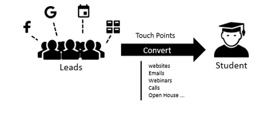

# Marketing campaigns optimization for an education institution 
Utilized machine learning technologies to analyze data in regards to marketing campaigns of an educational institution in the past 5 years and identify, through insight obtained, ideal methods to optimize marketing campaigns performance

### Basic Market facts of the Canadian education industry

- More than 2.12 million students in post-secondary institutions in Canada

- More than 500, 000 graduates each year 

- 42. 77 bn CAD expenditure each year  

- Around 30% of the expenditure is spending on Marketing & Sales, which is 13 billion CAD


###### Data Source 

The raw data consists of hundreds of touchpoints every student interacting with the marketing and sales team in the past 5 years. 




######Methodologies

Using the scikit-learn module build for python to conduct the analysis. First cleaning the raw data and only kept the important features that are relevant to our studies. After, I have tried different models and figured that the Random Forest model can predict the best result. I even tried different combinations of the features to see which marketing techniques are working and which are not, and drew the test results in a summary pdf and it could be opened inside the same folder.


###### Test running code

I have saved the model below and it could be used for future prediction 

```decision_tree_model.joblib
student_rf_best_model.joblib
```


###### Prediction

You can either use **pickle** or **joblib** to import the model. 

```
# using pickle 
def grabTree(filename):
    import pickle
    fr = open(filename, 'rb')
    return pickle.load(fr)
```

```
# using joblib
>>> from joblib import load
>>> load('filename.joblib') 
```

Import the preprocessing methods as well

```
# preprocess your input data before prediction
load('DictVectorizer.joblib')
```

And now you can predict the result using your own data to see how likely a student is going to convert to an opportunity.

An example is given in **predict.py**, you can check that out under the same folder

```
predict.py
```

